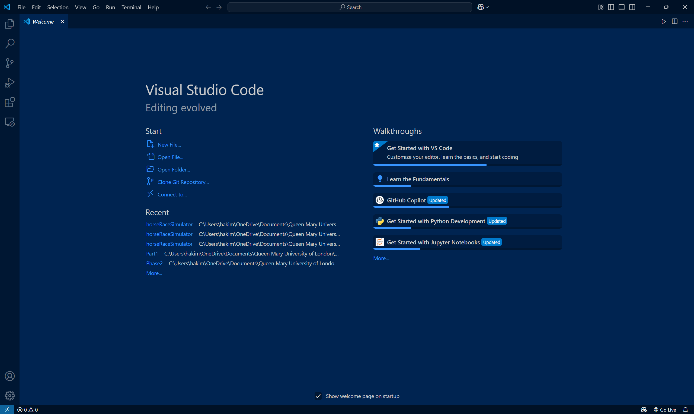
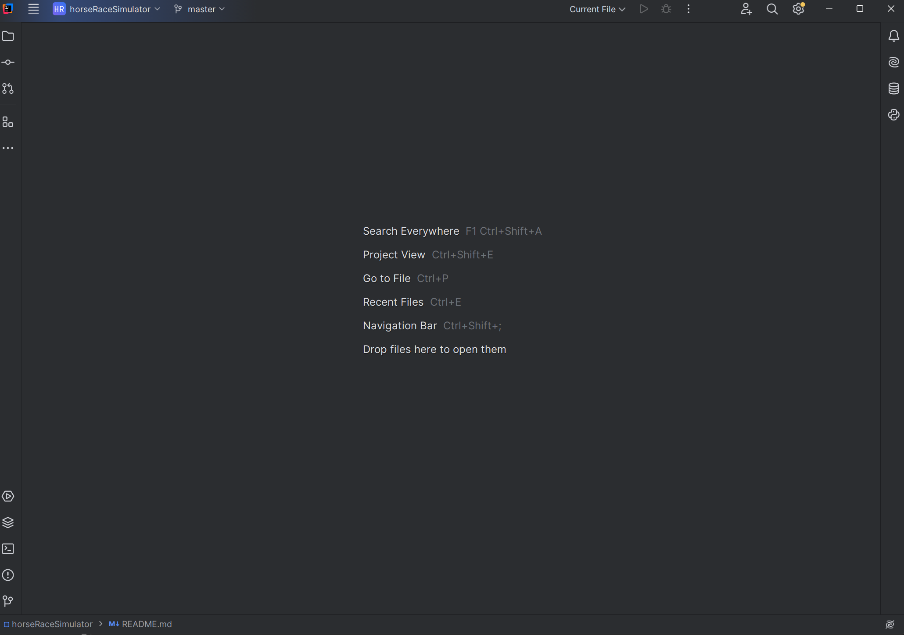

# 🏇 Horse Race Simulator

A Java-based Horse Race Simulator with a graphical user interface (GUI). This application allows users to simulate horse races, track race progress visually, and determine the winner.

## 🎯 Features
- 🏁 Simulates horse races with multiple participants
- 🎨 Graphical and Command line representation of the race
- ⚙️ Customizable race settings
- 🏆 Displays race results at the end
- ⏲️ Displays time taken to finish the race
- 💵 Betting system

## 🛠️ Setup Instructions

### 📌 Prerequisites
Ensure you have the following installed on your system:
- ☕ Java Development Kit (JDK) 8 or later
- 🖥️ An Integrated Development Environment (IDE) such as IntelliJ IDEA or Eclipse
- 🎭 JavaFX (if not included in your JDK)

### 🚀 Steps to Run the Project Locally
1. 📂 Clone the repository:
   ```sh
   git clone https://github.com/HakimM16/horseRaceSimulator
   ```
2. 🏗️ Open the project in your preferred IDE.
3. 🔧 Ensure that JavaFX is properly configured in your project (if needed).
4. ▶️ For Part 1, cd into Part 1 by typing `cd Part 1` in terminal, then type `java startRace` to compile and run the `startRace.java` file to start the application.
5. ▶️ For Part 2, compile and run the `startRaceGUI.java` file to start the application

## 📦 Dependencies
The project relies on the following dependencies:
- 🎭 JavaFX for the graphical user interface
- 📜 Standard Java libraries (e.g., `java.util`)

## 🎮 Usage Guidelines for Part 1
1. 🎬 Launch the application.
2. 🏇 Set the number of horses and race parameters.
3. ▶️ Make a prediction on one of the horses to win to begin the simulation.
4. 👀 Watch as horses progress across the screen.
5. 🏅 View race results at the end.
6. If using vscode or intellij, make sure it is in full screen to display the whole length of the track like this



## 🎮 Usage Guidelines for Part 2
1. 🎬 Launch the application.
2. ☁️ Set the number of horses, length of track, type of track and weather
3. 🏇 Customise each horse with different attributes (e.g. breed, coat colour, horseshoes)
4. 💵 Make a bet on one of horses up to £100,000
5. ▶️ Press `Start race` button to start the race or press `Reset` to reset the race
6. 👀 Watch as horses progress in the GUI
7. 🏅 View race results on the statistics GUI
8. 📜 View all races taken in the same code run in the history GUI
---

🏇 Enjoy the race!
